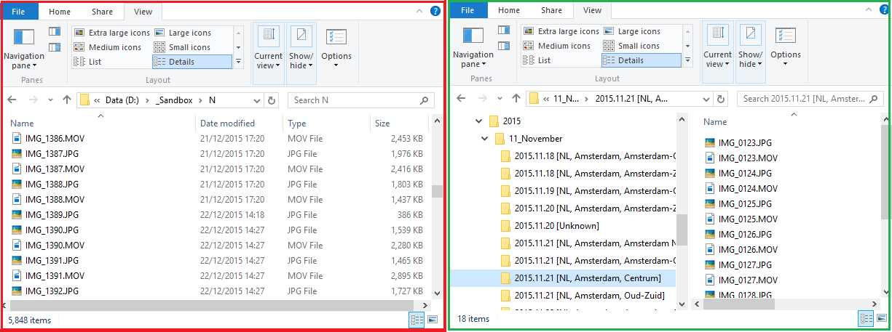

# PictureOrganizer
This script organizes your pictures and videos based on the embedded meta data like Dates and GPS Coordinates. Basically, takes a bunch of pictures and videos as seen on the first picture, and classifies them as seen on the second picture.



## Features
+ Supports Windows and Mac OS, yet Mac binaries are not included in the repo.
+ Supports most common picture and video formats. (More can be supported with little tweaks)
+ Supports meta tag substitution if one is not available. (e.g. if ```DateTimeOriginal``` tag is not available, uses ```MediaCreateDate```, if not uses ```CreateDate```)
+ Uses Google Maps API for reverse GeoCoding. (Converts GPS data ```[48.858494, 2.294486]``` to readable name ```[Eiffel Tower, Paris, France]```.
+ Supports GPS data in different meta tags.
+ Supports different geographical area categories for different countries. (Uses higher level geographic names for smaller countries, lower level geographic names for larger countries.)
+ Provides a Geocode cache, to reduce online Google API calls.
+ Supports metadata side-files like (```*.aae``` files) and relocates them to appropriate folders together with their underlying media file.
+ Sanitizes geographical names for unsupported charaters by the OS.
+ Debug and error logs are available.


## Quick Start
+ Clone this repo.
+ You will need to install [MSYS](http://www.mingw.org/wiki/msys) on Windows (If you don't use [Git For Windows](https://git-scm.com/download/win) already.)
+ Just add pictures to ```UnorganizedFiles``` folder.
+ Run the script like ```./OrganizeAllPictures.v34.sh```
